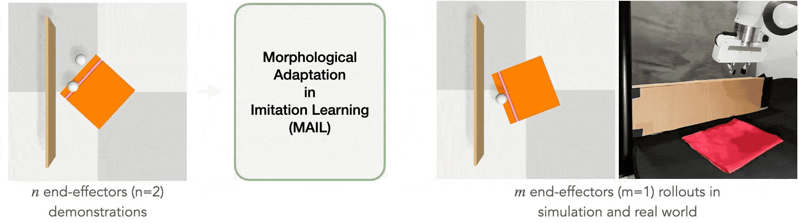

# Learning Robot Manipulation from Cross-Morphology Demonstration

[[Project website](https://uscresl.github.io/mail/)]
[[arXiv PDF](https://arxiv.org/abs/2304.03833)]

This project is a PyTorch implementation of Learning Robot Manipulation from Cross-Morphology Demonstration, published in CoRL, 2023.

<p align="center">
    
</p>

## SoftGym Installation

1. Create new conda environment.
```
conda create -n mail python=3.7
```

2. Install necessary packages for MAIL.
```
cd mail
mkdir data # for storing experiments
conda env update -n mail --file environment.yml
```
3. Follow the [docker guide](softgym/docker/docker.md) for installing PyFlex and SoftGym.

4. Verify that SoftGym is installed properly.
```
# First, exit docker
conda activate mail
export PYFLEXROOT=${PWD}/PyFlex
export PYTHONPATH=${PYFLEXROOT}/bindings/build:$PYTHONPATH
export LD_LIBRARY_PATH=${PYFLEXROOT}/external/SDL2-2.0.4/lib/x64:$LD_LIBRARY_PATH
```
4.1 (OPTIONAL) If you want these env variables set permanently, add these to your `.bashrc`.
```
cd path_to_mail/softgym
echo "export PYFLEXROOT=${PWD}/PyFlex" >> ~/.bashrc
echo "export PYTHONPATH=${PYFLEXROOT}/bindings/build:$PYTHONPATH" >> ~/.bashrc
echo "export LD_LIBRARY_PATH=${PYFLEXROOT}/external/SDL2-2.0.4/lib/x64:$LD_LIBRARY_PATH" >> ~/.bashrc
```
Run sample environment for install verification.
```
python examples/random_env.py --env_name PourWaterAmount # this should open up a GUI window running the PourWater task
```

## SoftAgent Installation


1. Update the conda env with additional packages required by SoftAgent.
```
# make sure you are at top level folder (/mail)
conda env update  --file environment.yml  --prune
```
2. Activate the conda environment by running the following in terminal (outside of docker):

```
. ./prepare_1.0.sh
```
Note that `prepare_1.0.sh` only adds env variables to your current bash. Consider adding these variables to your `.bashrc`, for use on all future bash sessions.

## Downloads

- Download the [cached_initial_states](https://drive.google.com/drive/folders/10_-OHPEaxJvUZCxIFeFVwu94U8y1OH2x?usp=share_link) and place it inside `mail/softgym/softgym/` folder.

- For reproducing experimental results, download the [checkpoints](https://drive.google.com/drive/folders/1l_xGQmw2eJCA69TGs2QMcavDbm404Umy?usp=sharing) folder and place it inside the `data/` folder.

- For training the forward dynamics model and running trajectory optimization to generate the student dataset, download the random actions dataset and teacher demonstrations [here](https://drive.google.com/drive/folders/1jo9n0n45gFFJsNQnicpA4wLdBNxjCzXK?usp=sharing). Place these files inside the `data/` folder.

## Experiments

### Dry Cloth

```
############ Training ############

# MAIL (ours)
sh ./scripts/data_generation/drycloth_two_picker_demos.sh   # generate teacher demonstrations (optional if you have downloaded the file)
sh ./scripts/data_generation/drycloth_random_actions.sh     # generate random actions dataset (optional if you have downloaded the file)
sh ./scripts/train/ours/drycloth_forward_dynamics.sh        # train forward dynamics model
sh ./scripts/train/ours/drycloth_cem_hyperparameters.sh     # find the best hyper-parameters for CEM
sh ./scripts/train/ours/drycloth_traj_opt.sh                # use trajectory optimization with learned dynamics to create student dataset
sh ./scripts/train/ours/drycloth_gen_student_dataset.sh     # generate student dataset via interacting with Softgym environment
sh ./scripts/train/ours/drycloth_dmfd.sh                    # train DMfD with student dataset

# SAC-CURL
sh ./scripts/train/sac_curl/drycloth_sac_curl.sh

# SAC-DrQ
sh ./scripts/train/sac_drq/drycloth_sac_drq.sh

# SAC-DrQ-IR
sh ./scripts/train/sac_drq_ir/drycloth_sac_drq_ir.sh

############ Evaluation ############

# MAIL (ours)
sh ./scripts/eval/ours/drycloth_dmfd.sh

# SAC-CURL
sh ./scripts/eval/sac_curl/drycloth_eval.sh

# SAC-DrQ
sh ./scripts/eval/sac_drq/drycloth_eval.sh

# SAC-DrQ-IR
sh ./scripts/eval/sac_drq_ir/drycloth_eval.sh
```

### ClothFold

```
############ Training ############

# MAIL (ours)
sh ./scripts/data_generation/clothfold_two_picker_demos.sh  # generate teacher demonstrations (optional if you have downloaded the file)
sh ./scripts/data_generation/clothfold_random_actions.sh    # generate random actions dataset (optional if you have downloaded the file)
sh ./scripts/train/ours/clothfold_forward_dynamics.sh       # train forward dynamics model
sh ./scripts/train/ours/clothfold_cem_hyperparameters.sh    # find the best hyper-parameters for CEM
sh ./scripts/train/ours/clothfold_traj_opt.sh               # use trajectory optimization with learned dynamics to create student dataset
sh ./scripts/train/ours/clothfold_gen_student_dataset.sh    # generate student dataset via interacting with Softgym environment
sh ./scripts/train/ours/clothfold_dmfd.sh                   # train DMfD with student dataset

# SAC-CURL
sh ./scripts/train/sac_curl/clothfold_sac_curl.sh

# SAC-DrQ
sh ./scripts/train/sac_drq/clothfold_sac_drq.sh

# SAC-DrQ-IR
sh ./scripts/train/sac_drq_ir/clothfold_sac_drq_ir.sh


############ Evaluation ############

# MAIL (ours)
sh ./scripts/eval/ours/clothfold_dmfd.sh

# SAC-CURL
sh ./scripts/eval/sac_curl/clothfold_eval.sh

# SAC-DrQ
sh ./scripts/eval/sac_drq/clothfold_eval.sh

# SAC-DrQ-IR
sh ./scripts/eval/sac_drq_ir/clothfold_eval.sh
```

### GAIfO and GPIL Experiments
Code is based on the official implementation of [Generalizable Imitation Learning from Observation via Inferring Goal Proximity](https://github.com/clvrai/goal_prox_il).

1. Install additional packages.

```
cd goal_prox_il/
pip install -r requirements.txt

cd d4rl
pip install -e .

cd ../rl-toolkit
pip install -e .

mkdir -p data/trained_models
```

2. Create an `expert_datasets` folder.
```
cd ../
mkdir expert_datasets
```

3. Download [expert files](https://drive.google.com/drive/folders/1W1KF06PdydnDt_Un_kepjvCETtB4Hsy6?usp=sharing) and place them inside the `expert_datasets` folder. Alternatively, you can genereate the expert files locally by running `sh ./scripts/train/gpil/drycloth_gen_dataset.sh` for Dry Cloth and `sh ./scripts/train/gpil/clothfold_gen_dataset.sh` for Cloth Fold.

#### Dry Cloth
```
############ Training ############
# GAIfO
sh ./scripts/train/gaifo/drycloth_training.sh

# GPIL
sh ./scripts/train/gpil/drycloth_training.sh

############ Evaluation ############
# GAIfO
sh ./scripts/eval/gaifo/drycloth_eval.sh

# GPIL
sh ./scripts/eval/gpil/drycloth_eval.sh
```

#### Cloth Fold
```
############ Training ############
# GAIfO
sh ./scripts/train/gaifo/clothfold_training.sh

# GPIL
sh ./scripts/train/gpil/clothfold_training.sh

############ Evaluation ############
# GAIfO
sh ./scripts/eval/gaifo/clothfold_eval.sh

# GPIL
sh ./scripts/eval/gpil/clothfold_eval.sh
```

### GNS Experiments
Code is based on the official implementation of [Learning Visible Connectivity Dynamics for Cloth Smoothing](https://github.com/Xingyu-Lin/VCD).

Checkout the `gns` branch of this repository and follow the installation instructions in the README.
```
git checkout gns
```

## Cite
If you find this codebase useful in your research, please consider citing:
```
@inproceedings{salhotra2023mail,
      title={Learning Robot Manipulation from Cross-Morphology Demonstration},
      author={Gautam Salhotra and I-Chun Arthur Liu and Gaurav S. Sukhatme},
      booktitle={Conference on Robot Learning},
      year={2023}
}
```
